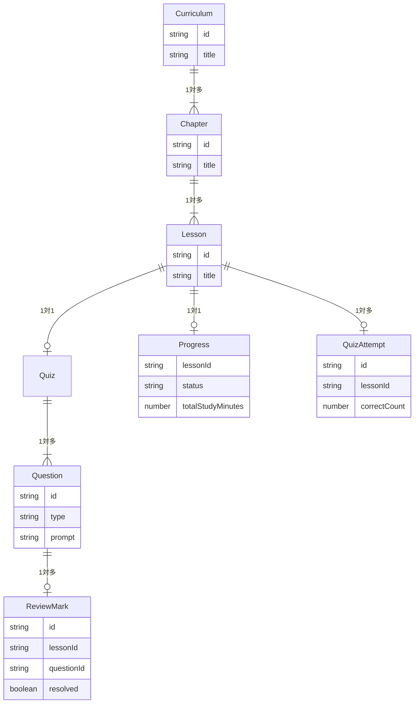

# LearningApp

## 概要
React と Redux Toolkit を使用して作成した、プログラミングなどの学習進捗やクイズ回答結果を記録・管理できるWebアプリです。

* **公開URL**: https://sample-learning-app.vercel.app/

## 主な機能
* **進捗・学習時間管理**
  * 単元ごとの進捗（未学習/学習中/完了）管理と、学習時間の自動計測
* **確認クイズ＆自動採点**
  * 選択式・記述式のクイズと自動採点機能
* **復習マーク＆履歴機能**
  * 間違えた問題の復習リスト化と、過去の回答履歴の保存
* **ダッシュボード**
  * 直近の学習履歴や正答率推移のグラフ表示
* **データ永続化 (localStorage)**
  * アプリの状態（進捗・履歴・復習マーク等）をローカルストレージへ自動保存・復元

## 利用技術
* **フロントエンド**: React, TypeScript, React Router
* **状態管理**: Redux Toolkit
* **データ可視化**: Recharts
* **UI/ビルド**: Tailwind CSS, Vite
* **テスト環境**: Vitest
* **パッケージマネージャー**: npm
* **ホスティング**: Vercel

## 設計のポイント
* **Redux Toolkitによる状態管理**
  アプリ全体のデータ（進捗、クイズ履歴、復習マークなど）を一括管理し、画面間でのデータ連携をスムーズにしています。
  
## スライス構造図

```mermaid
graph TD
    RootState[RootState (store/index.ts)] --> curriculum[curriculumSlice : カリキュラム・問題マスタ]
    RootState --> progress[progressSlice : 進捗・学習時間]
    RootState --> history[historySlice : クイズ回答履歴]
    RootState --> review[reviewSlice : 復習マーク]
    RootState --> quiz[quizSlice : クイズ回答]
    RootState --> ui[uiSlice : トースト表示等のUI]

    %% 相互参照関係
    curriculum & progress & history --> Dashboard[ダッシュボード表示]
    curriculum & review --> ReviewPage[復習ページ表示]
    history & progress --> StudyChart[学習時間グラフ]
```

## データモデル図


## セットアップ手順

### 動作環境
* **Node.js**: v20.0.0 以上推奨
* **npm**: v10.0.0 以上

### 手順
1. リポジトリをクローンします。
   ```bash
   git clone https://github.com/portfolio8931/Sample_LearningApp.git
   cd Sample_LearningApp
   ```
2. 依存パッケージをインストール、開発用サーバー（ローカル環境）を起動します。
   ```bash
   npm install
   npm run dev
   ```
3. テストの実行
   ```bash
   npm test
   ```
